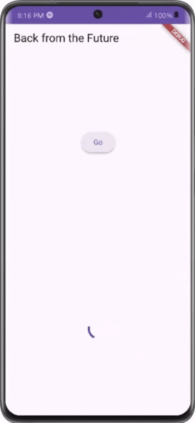

# Tugas Pemrograman Asynchronous di Flutter


## Deskripsi Proyek

Proyek Flutter yang mendemonstrasikan operasi asynchronous dan integrasi API.

## Laporan Praktikum

### Soal no 1
Menambahkan nama panggilan pada title app sebagai identitas hasil pekerjaan.

```dart
Widget build(BuildContext context) {
  return MaterialApp(
    title: 'Dwi Bayu',
    theme: ThemeData(
      primarySwatch: Colors.blue,
      visualDensity: VisualDensity.adaptivePlatformDensity,
    ),
    home: const FuturePage(),
  );
}
```

### Soal no 2

Implementasi pencarian buku menggunakan Google Books API.
[Lihat Contoh Buku Batman](https://www.google.co.id/books/edition/Batman_and_Philosophy/hf5f3r38P1cC)


### Soal no 3

```dart
setState(() {
  getData().then((value) {
    result = value.body
        .toString()
        .substring(0, 450);
    setState(() {});
  }).catchError((_) {
    result = 'An error occurred';
    setState(() {});
  });
});
```

#### Penjelasan:

- **Implementasi Substring**: Mengambil 450 karakter pertama dari respons
- **Catch Error**: Menangani kegagalan API dengan baik
- **Set State**: Memperbarui UI secara tepat

#### Demo


### Soal no 4

#### Langkah 1
```dart
Future<int> returnOneAsync() async {
  await Future.delayed(const Duration(seconds: 3));
  return 1;
}

Future<int> returnTwoAsync() async {
  await Future.delayed(const Duration(seconds: 3));
  return 2;
}

Future<int> returnThreeAsync() async {
  await Future.delayed(const Duration(seconds: 3));
  return 3;
}
```

#### Langkah 2
```dart
Future count() async {
  int total = 0;
  total += await returnOneAsync();
  total += await returnTwoAsync();
  total += await returnThreeAsync();
  setState(() {
    result = total.toString();
  });
}
```

#### Penjelasan:
- **Fungsi returnOneAsync()**: untuk mengembalikan nilai 1 setelah 3 detik
- **Fungsi returnTwoAsync()**: untuk mengembalikan nilai 2 setelah 3 detik
- **Fungsi returnThreeAsync()**: untuk mengembalikan nilai 3 setelah 3 detik
- **Future count() async**: Fungsi count() untuk menjumlahkan nilai yang dikembalikan oleh fungsi returnOneAsync(), returnTwoAsync(), dan returnThreeAsync(). Menggunakan setState() untuk memperbarui UI dengan hasil total
Hasil akhir dikonversi ke string dan disimpan dalam variabel result


### Soal No 5

#### Langkah 2
```dart
late Completer completer;

Future getNumber() {
  completer = Completer<int>();
  calculate();
  return completer.future;
}

Future calculate() async {
  await Future.delayed(const Duration(seconds : 5));
  completer.complete(42);
}
```

#### Penjelasan:
- **late Completer**: Menggunakan keyword late karena akan diinisialisasi nanti. Completer adalah class untuk mengelola Future secara manual
- **Fungsi getNumber()**: Membuat Completer baru yang akan menghasilkan nilai integer. Memanggil fungsi calculate() secara async. Mengembalikan Future yang akan selesai ketika Completer complete
- **Fungsi calculate()**: Fungsi async dengan delay 5 detik
Setelah delay, menyelesaikan Completer dengan nilai 42

#### Demo

### Soal No 6

#### Langkah 5-6

```dart
calculate() async {
  try {
    await Future.delayed(const Duration(seconds: 5));
    completer.complete(42);
  } catch (_) {
    completer.completeError({});
  }
}

getNumber().then((value) {
  setState(() {
    result = value.toString();
  });
}).catchError((e) {
  result = 'An error occurred';
});
```

#### Penjelasan:

- **Perbedaan**:

1. Penanganan Error

- Sebelumnya: Tidak ada penanganan error secara eksplisit
- Sekarang: Menggunakan try-catch untuk menangkap error yang mungkin terjadi

2. Complete Error

- Sebelumnya: Hanya bisa complete dengan nilai sukses (42)
- Sekarang: Bisa complete dengan:
  - Sukses: completer.complete(42)
  - Error: completer.completeError({})
- **Fungsi getNumber()**: 
- Dapat menangkap error yang di-propagate dari calculate()
- Menampilkan pesan error ke UI jika terjadi kesalahan

#### Demo


### Soal No 7

#### Demo


### Soal No 8
 
 #### Perbedaan Langkah 1 & 4
 
 ```dart
 // Langkah 1
 void returnFG() {
     FutureGroup<int> futureGroup = FutureGroup<int>();
     futureGroup.add(returnOneAsync());
     futureGroup.add(returnTwoAsync());
     futureGroup.add(returnThreeAsync());
     futureGroup.close();
     futureGroup.future.then((List<int> value) {
       int total = 0;
       for (var element in value) {
         total += element;
       }
       setState(() {
         result = total.toString();
       });
     });
 }
 
 // Langkah 4
 final futures = Future.wait<int>([
   returnOneAsync(),
   returnTwoAsync(),
   returnThreeAsync(),
 ]);
 
 
 ```
 
 #### Penjelasan:
 
 - **Perbedaan**:
 
 1. Fleksibilitas:
 
 - FutureGroup: Bisa menambah Future secara dinamis
 - Future.wait: Future harus ditentukan saat deklarasi
 
 2. Sintaks:
 
 - FutureGroup: Perlu inisialisasi, penambahan, dan penutupan (close)
 - Future.wait: Lebih ringkas dengan satu baris kode
 
 3. Use Case:
 
 - FutureGroup: Cocok untuk skenario dinamis
 - Future.wait: Cocok untuk skenario statis

 ### Soal No 9

#### Demo


### Soal No 10
 
 #### Hasil Running
 
 - Ketika tombol "Go" ditekan:
 
 1. Akan menunggu 2 detik (delay)
 2. Menampilkan pesan error: "Exception: Something terrible happened!"
 3. Mencetak "Complete" di console
 
 #### Perbedaan Langkah 1 dan 4
 
 **Langkah 1: returnError()**
 
 ```dart
 Future returnError() async {
     await Future.delayed(const Duration(seconds: 2));
     throw Exception('Something terrible happened !');
 }
 ```
 
 - Hanya membuat Future yang akan throw Exception
 - Tidak ada penanganan error
 - Akan crash aplikasi jika tidak ditangkap
 
 **Langkah 4: handleError()**
 
 ```dart
 Future handleError() async {
     try {
       await returnError();
     } catch (error) {
       setState(() {
         result = error.toString();
       });
     } finally {
       print('Complete');
     }
 }
 ```
 
 - Menangkap error dari returnError() menggunakan try-catch
 - Menampilkan pesan error ke UI menggunakan setState
 - Memiliki block finally yang akan selalu dieksekusi
 - Mencegah aplikasi crash dengan penanganan error yang tepat

 ### Soal No 11
 
 ```dart
  @override
   Widget build(BuildContext context) {
     return Scaffold(
       appBar: AppBar(
         title: const Text('Current Location Bayu'),
       ),
       body: Center(
         child: Text(myPosition),
       ),
     );
   }
 ```
 
 Menambahkan nama panggilan tiap properti title sebagai identitas pekerjaan.

 ### Soal No 12
 
 ```dart
 // Menambahkan delay 3 detik untuk loading
     await Future.delayed(const Duration(seconds: 3));
 ```
 
 - Apakah Anda mendapatkan koordinat GPS ketika run di browser? Mengapa demikian?
 
 Ya, koordinat GPS didapatkan ketika menjalankan aplikasi di browser karena beberapa alasan:
 
 1. Package Geolocator Web Support
 
 - Package geolocator sebenarnya memiliki dukungan web melalui plugin geolocator_web
 - Plugin ini secara otomatis menggunakan HTML5 Geolocation API ketika dijalankan di browser
 
 2. Browser Permission
 
 - Browser modern mendukung HTML5 Geolocation API
 - Saat aplikasi meminta akses lokasi, browser akan menampilkan prompt permission ke pengguna
 - Jika user mengizinkan, koordinat GPS bisa didapatkan
 
 

### Soal No 13

Apakah ada perbedaan UI dengan praktikum sebelumnya? Mengapa demikian?

Ya, ada sedikit perbedaan UI dengan praktikum sebelumnya karena beberapa faktor:

1. Struktur Widget yang Berbeda

```dart
// Praktikum Sebelumnya
final myWidget = myPosition == ''
    ? const CircularProgressIndicator()
    : Text(myPosition);

// Praktikum Saat ini
child: FutureBuilder(
    future: position,
      builder: (context, AsyncSnapshot<Position> snapshot) {
        if (snapshot.connectionState == ConnectionState.waiting) {
            return const CircularProgressIndicator();
          } else if (snapshot.connectionState == ConnectionState.done) {
            return Text(snapshot.data.toString());
          } else {
            return const Text('');
          }
    }),
```

2. Perbedaan Pendekatan
- Sebelumnya: Menggunakan variabel myPosition (String) untuk menentukan tampilan
- Sekarang: Menggunakan FutureBuilder yang langsung mengelola state dari Future
3. Alasan Perbedaan
- FutureBuilder lebih tepat untuk menangani async operations
- Memberikan kontrol lebih baik atas state loading
- Langsung menghandle perubahan state dari Future
- Tidak perlu manual update variabel myPosition
4. Keuntungan Menggunakan FutureBuilder
- Otomatis menangani state loading
- Lebih clean dan maintainable
- Built-in error handling
- Reactive terhadap perubahan Future
#### Demo


Seperti yang Anda lihat, menggunakan FutureBuilder lebih efisien, clean, dan reactive dengan Future bersama UI.

Karena dengan FutureBuilder lebih baik karena lebih sesuai dengan pattern async programming di Flutter.

### Soal No 14
 
 Apakah ada perbedaan UI dengan langkah sebelumnya? Mengapa demikian?
 
 Tidak ada perubahan UI jika tidak ada error, Alasan tidak ada perubahan :
 
 1. Tampilan Normal
 
 - Jika tidak ada error: Tidak ada perbedaan UI
 - Tetap menampilkan koordinat lokasi
 
 2. Tampilan Error
 
 - Sebelumnya: Might crash atau menampilkan error system
 - Sekarang: Menampilkan pesan "Something terrible happened!"
 
 3. Keunggulan Pendekatan Baru
 
 - Menangani error dengan lebih elegan
 - User experience lebih baik
 - Mencegah crash aplikasi
 - Memberikan feedback yang jelas ke pengguna
 
 #### Demo
 
 
 ### Soal No 15

Menambahkan nama panggilan Anda pada tiap properti title di class NavigationFirst sebagai identitas pekerjaan.

```dart
appBar: AppBar(
        title: const Text('Current Location Bayu'),
      ),

```

Menganti dengan warna tema favorit.

```dart
Color color = Colors.greenAccent;
```

### Soal No 16
 
 Cobalah klik setiap button, apa yang terjadi ? Mengapa demikian ?
 Yang terjadi saat mengklik button:
 
 1. First Screen Button (Change Color)
 
 - Saat diklik, navigasi ke halaman kedua
 - Background screen pertama masih terlihat di belakang
 - Menggunakan Navigator.push()
 
 2. Second Screen Buttons
 
 - Setiap button warna ketika diklik akan:
 - Mengubah warna background First Screen
 - Menutup Second Screen
 - Kembali ke First Screen dengan warna baru
 
 Mengapa Demikian?
 
 1. Mekanisme Navigasi
 
 ```dart
 Future _navigateAndGetColor(BuildContext context) async {
     color = await Navigator.push(
           context,
           MaterialPageRoute(builder: (context) => const NavigationSecond()),
         ) ??
         Colors.blue;
     setState(() {});
 }
 ```
 
 - Navigator.push() menambah route baru ke stack
 - await menunggu nilai return dari Second Screen
 - setState() memperbarui UI dengan warna baru
 
 2. Data Passing
 
 - Warna dipilih di Second Screen
 - Dikirim kembali ke First Screen menggunakan Navigator.pop(color)
 - First Screen menerima dan mengupdate state
 
 Ganti 3 warna pada langkah 5 dengan warna favorit
 
 ```dart
             ElevatedButton(
               onPressed: () {
                 color = Colors.lime;
                 Navigator.pop(context, color);
               },
               child: const Text('Change to Lime'),
             ),
             ElevatedButton(
               onPressed: () {
                 color = Colors.deepOrange;
                 Navigator.pop(context, color);
               },
               child: const Text('Change to Deep Orage'),
             ),
             ElevatedButton(
               onPressed: () {
                 color = Colors.pink;
                 Navigator.pop(context, color);
               },
               child: const Text('Change to Pink'),
             ),
 ```
 
 #### Demo
 
 

 ### Soal No 17
 
 Cobalah klik setiap button, apa yang terjadi ? Mengapa demikian ?
 
 **Apa yang Terjadi?**
 Ketika mengklik button pada Alert Dialog:
 
 1. Button "Change Color"
 
 - Membuka Alert Dialog
 - Menampilkan 3 pilihan warna
 - Background gelap (barrier) menghalangi interaksi dengan screen di belakangnya
 
 2. Button Warna (Red/Green/Blue)
 
 - Mengubah warna background Scaffold
 - Menutup Alert Dialog
 - Kembali ke screen utama dengan warna baru
 
 **Mengapa Hal Ini Terjadi?**
 
 ```dart
 TextButton(
     onPressed: () {
         color = Colors.red.shade700;  // Set warna baru
         Navigator.pop(context, color); // Tutup dialog
     },
     child: Text('Red')
 ),
 
 ```
 
 Proses yang terjadi:
 
 1. State Management
 
 - Variable color diupdate dengan warna baru
 - setState() dipanggil setelah dialog ditutup
 - Trigger rebuild widget dengan warna baru
 
 2. Dialog Control
 
 - barrierDismissible: false mencegah dialog ditutup dengan tap di luar
 - Navigator.pop() menutup dialog secara programatis
 - Warna diteruskan kembali ke screen utama
 
 3. UI Update
 
 - backgroundColor: color pada Scaffold menggunakan warna yang dipilih
 - Widget tree di-rebuild dengan warna baru
 - Transisi warna terjadi secara instan
 
 Mengganti 3 warna pada langkah 3 dengan warna favorit!
 
 ```dart
               TextButton(
                   onPressed: () {
                     color = Colors.lime;
                     Navigator.pop(context, color);
                   },
                   child: Text('Lime')),
               TextButton(
                   onPressed: () {
                     color = Colors.deepOrange;
                     Navigator.pop(context, color);
                   },
                   child: Text('Deep Orange')),
               TextButton(
                   onPressed: () {
                     color = Colors.pink;
                     Navigator.pop(context, color);
                   },
                   child: Text('Pink')),
 ```
 
 #### Demo
 
 
